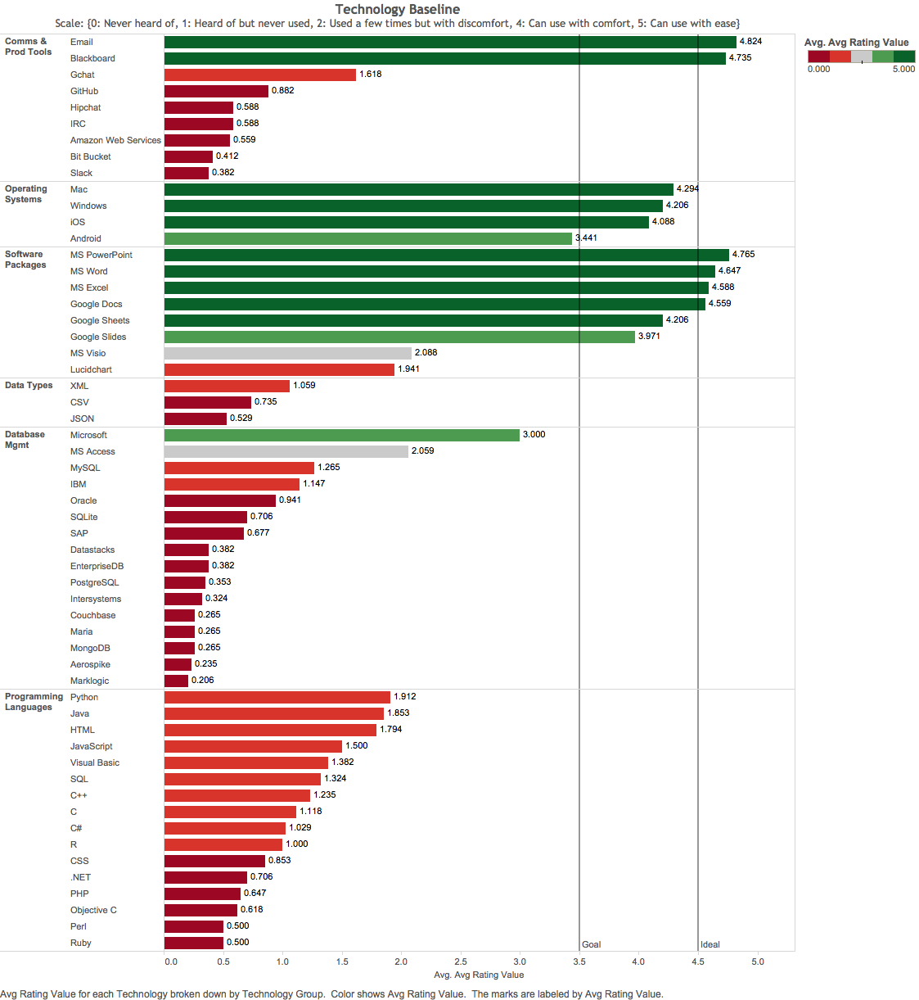
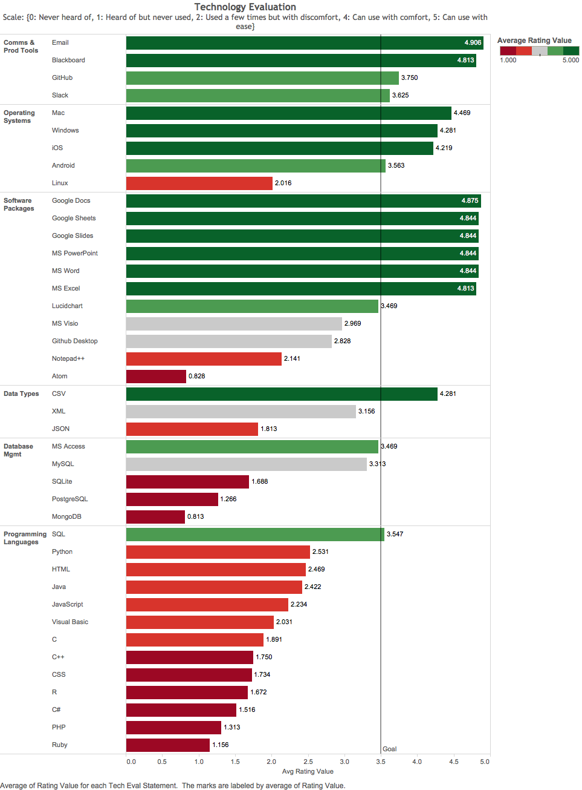
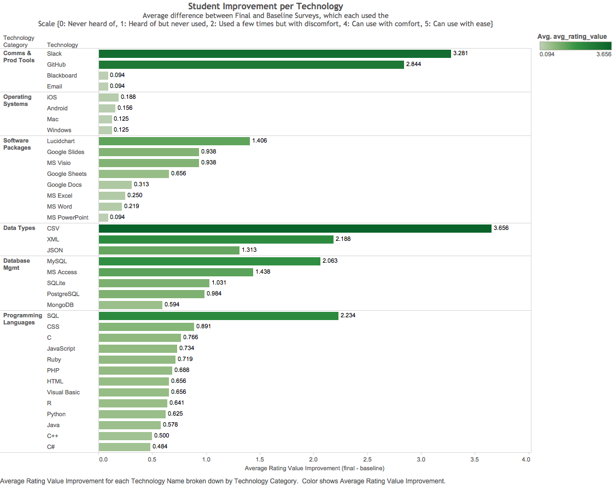
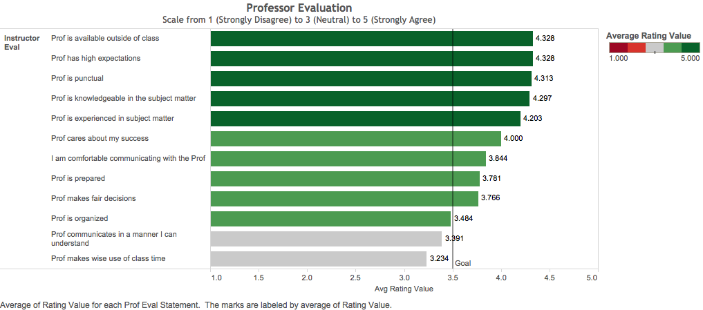
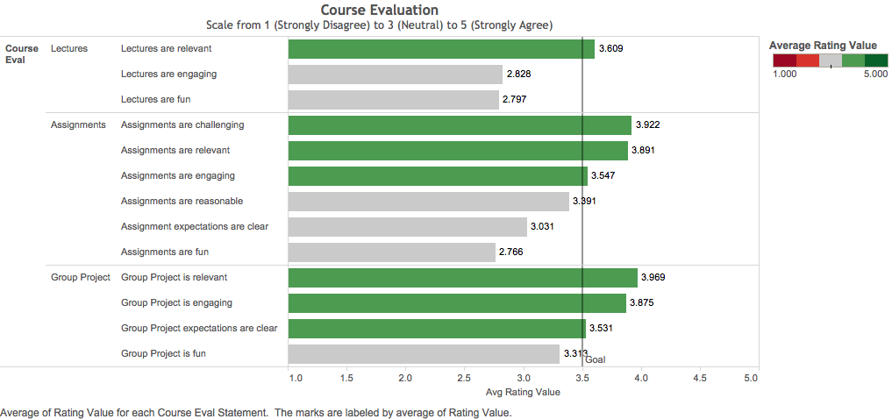

# Post Mortem Report

## Results

### Student Learning

#### Technology Skills
##### Baseline Survey

On the first day of class, students took a baseline technology comfort survey.

The baseline survey revealed a strong foundation in documents, presentation, and spreadsheet software, as well as opportunities to improve comfort with diagramming software, database management software, SQL, and data processing.

##### Exit Survey

On the last day of class, students responded to an exit survey which included a follow-up section on technology comfort levels.

The exit survey revealed moderate-to-high levels of comfort with diagramming software, SQL, and data processing - especially of .csv files.

The greatest gains came in technologies with which the students had a low baseline of comfort (e.g. GitHub, Slack, and processing .csv files), however students also made modest gains in SQL, MS Access, and MySQL with which they had indicated prior familiarity.

#### Learning Objectives

These technology skill improvements were confirmed by students when they indicated in the exit survey the degree to which they thought they had met their learning objectives.

On average, students said they improved most in acquiring subject matter knowledge, learning technology skills, and leveraging technology as an outlet for creativity, while on average they said they did not much improve their writing skills.

#### Final Grades

These student learning successes were reflected in their final letter grades, where 23 of 36 (~64%) earned an A or B. On average, students earned a low B, with a mean final grade of 81.68 and a median of 83.54.

In general, there was a slight correlation between youth and the ability to earn an A or B.

All students from the home region of Asia or South America earned As or Bs, while a majority of students from the Middle East did not. All students who earned a full A came from the United States.

### Instructor Performance

Just as the professor evaluated student learning, students also evaluated the professor.

While they gave the professor high marks for subject matter knowledge and experience, and the degree to which they could relate and communicate with the professor, they indicated opportunities for the professor to improve clarity of communications and usage of class-time.

Ultimately, 15 of 36 students (~42%) recommended the professor for teaching this course in future semesters, while a single student (~3%) did not. A majority of students expressed indifference.

Most of this indifference came from a cohort of graduating Seniors.

### Course Administration

When given an opportunity to give feedback on the course itself, students highlighted several areas of improvement.

Most notably, they reported a general lack of fun. They also indicated an opportunity to improve clarity of assignment expectations.
